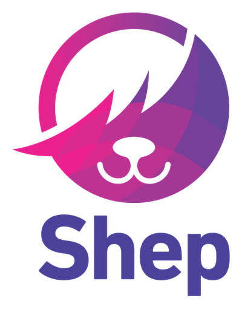
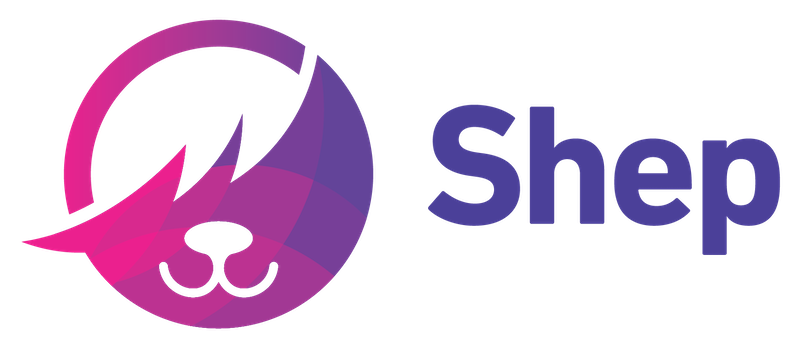
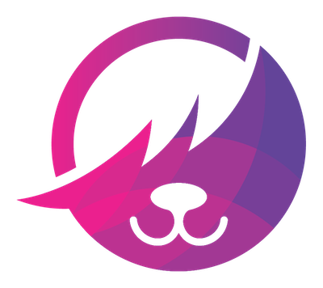

# Shep Style Guide

### [Colors 🎨](./colors.md)
### [Components 🧩](./components.md)
### [Grid ⌗](./grid.md)
### [Icons 💟](./icons.md)
### [Identity 🆒](./identity.md)
### [Images 🌄](./images.md)
### [Logos 🌀](./logos.md)
### [Typography 💤](./typography.md)
### [Writing 🖋️](./writing.md)

<!-- 
## Logos 

The Shep brand mark is available in the following color variations and two (2) orientations — _stacked_ and _horizontal_.
| Name | Logo | Source |
| ---  | :---:  | ---  |
| Stacked |  | Royal - [Low Res](img/logos/logo-stacked-royal.png), [High Res](img/logos/logo-stacked-royal@2x.png) <br> White - [Low Res](img/logos/logo-stacked-white.png), [High Res](img/logos/logo-stacked-white@2x.png) |
| Horizontal |  | Royal - [Low Res](img/logos/logo-horizontal-royal.png), [High Res](img/logos/logo-horizontal-royal@2x.png) <br> White - [Low Res](img/logos/logo-horizontal-royal.png), [High Res](img/logos/logo-horizontal-royal@2x.png) |
| Basic | | Royal - [Low Res](img/logos/logo-basic-royal.png), [High Res](img/logos/logo-basic-royal@2x.png) <br> White - [Low Res](img/logos/logo-basic-white.png), [High Res](img/logos/logo-basic-white@2x.png)  |

---

## Typography 

While the word mark is made from DIN Next LT Pro, with headings and body copy cast in the friendliness of PT Sans, for an elegant and approachable combination that embodies our spirit. Roboto Condensed is a tall and natural application with its mechanical skeleton and geometric form.

### Fonts & Typefaces

### Headings
Headings should use **PT Sans**, Bold (`700`). 

### Labels & Buttons
Labels - like _input_ labels or _button_ labels - should use **PT Sans**, Bold (`700`). Button labels should always use _uppercase_. 


### Typefaces

| Typeface | Weights Used | Usage | Embed | Download |
| --- | --- | --- | --- | --- |
| PT Sans  | 400, 700 | Used for body copy. Bold, Regular. | ```<link href="https://fonts.googleapis.com/css2?family=PT+Sans:wght@400;700&display=swap" rel="stylesheet">``` | [Google Fonts](https://fonts.google.com/specimen/PT+Sans?query=PT&sidebar.open&selection.family=PT+Sans:wght@400;700) |
| Roboto Condensed | 400, 700 | Used where headlines or body copy aren't sufficient | ```<link href="https://fonts.googleapis.com/css2?family=Roboto+Condensed:wght@400;700&display=swap" rel="stylesheet"> ``` | [Google Fonts](https://fonts.google.com/specimen/Roboto+Condensed?query=Roboto&sidebar.open&selection.family=Roboto+Condensed:wght@400;700)


---

## Colors 

### Palette
| Name | Color | Hex | SASS | CSS Custom Prop |
| --- | :---: | --- | --- | --- |
| Royal Dark |  | `#48136A` | `$color-royal-dark` | `--color-royal-dark` |
| Royal |  | `#774099` | `$color-royal` | `--color-royal` |
| Royal Light |  | `#A86DCA` | `$color-royal-light` | `--color-royal-light` |
| Dayglow Dark |  | `#AB0061` | `$color-dayglow-dark` | `--color-dayglow-dark` |
| Dayglow |  | `#E21E8E` | `$color-dayglow` | `--color-dayglow` |
| Dayglow Light |  | `#FF61BE` | `$color-dayglow-light` | `--color-dayglow-light` |
| Dayglow Lightest |  | `#FFF7FC` | `$color-dayglow-lightest` | `--color-dayglow-lightest` |
| Smoky |  | `#1A1A1A` | `$color-gray-700` | `--color-gray-700` |
| Eclipse |  | `#343434` | `$color-gray-600` | `--color-gray-600` |
| Primer |  | `#5B5B5B` | `$color-gray-500` | `--color-gray-500` |
| Granite |  | `#8E8E8E` | `$color-gray-400` | `--color-gray-400` |
| Charcoal |  | `#CBCBCB` | `$color-gray-300` | `--color-gray-300` |
| Eerie |  | `#EAEAEA` | `$color-gray-200` | `--color-gray-200` |
| Heather |  | `#F4F4F4` | `$color-gray-100` | `--color-gray-100` |
| White |  | `#FFFFFF` | `$color-white` | `--color-white` |
| Success |  | `#1DE255` | `$color-util-success` | `--color-util-success` |
| Warning |  | `#E7E435` | `$color-util-warning` | `--color-util-warning` |
| Danger |  | `#E21D1D` | `$color-util-danger` | `--color-util-danger` |
| Royal Gradient |  | `linear-gradient(135deg, $color-dayglow 0%, $color-royal-dark 100%)` | `$color-grad` | `--color-grad` |

### Partner Colors
<details>
<summary> Palette </summary>

| Name | Color | Hex | SASS | CSS Custom Prop |
| --- | :---: | --- | --- | --- |
| FCM Brand |  | `#00457C` | `$color-fcm-brand` | `--color-fcm-brand` |
| FCM Gradient |  | `linear-gradient(135deg, rgba($color-fcm-grad,0.37) 0%, $color-fcm-grad 100%);` | `$color-fcm-grad` | `--color-fcm-grad` |
| CT Brand |  | `#00444F` | `$color-ct-brand` | `--color-ct-brand` |
| CT Gradient |  | `linear-gradient(135deg, rgba($color-ct-grad,0.37) 0%, $color-ct-grad 100%);` | `$color-ct-grad` | `--color-ct-grad` |
</details>


### SASS Variables

#### Usage
`color: $color-gray-500`

#### List of Variables
<details>
<summary> SASS / SCSS Variables Snippet </summary>

```
$color-royal:            #774099;
$color-royal-dark:       #48136A;
$color-royal-light:      #A86DCA;  

$color-dayglow:          #E21E8E;  
$color-dayglow-dark:     #AB0061;  
$color-dayglow-light:    #FF61BE;  
$color-dayglow-lightest: #FFF7FC;  

$color-gray-700:         #1A1A1A;  
$color-gray-600:         #343434;  
$color-gray-500:         #5B5B5B;  
$color-gray-400:         #8E8E8E;  
$color-gray-300:         #CBCBCB;  
$color-gray-200:         #EAEAEA;  
$color-gray-100:         #F4F4F4;  

$color-white:            #FFFFFF;

$color-util-success:     #1DE255;
$color-util-warning:     #E7E435;
$color-util-danger:      #E21D1D;

$color-gradient: linear-gradient(135deg, $color-dayglow, $color-royal);

```

</details>


### CSS Custom Properties

#### Documentation
- [Can I Use - CSS Custom Properties](https://caniuse.com/#search=custom%20properties)    
- [Mozilla - Custom Properties CSS Variables](https://developer.mozilla.org/en-US/docs/Web/CSS/--*)

#### Usage
`color: var(--color-gray-500)`
  
#### List of Variables
<details> 
<summary> Custom Properties Variables Snippet </summary>

```
:root {

    --color-royal:            #774099; 
    --color-royal-dark:       #48136A;
    --color-royal-light:      #A86DCA;

    --color-dayglow:          #E21E8E;
    --color-dayglow-dark:     #AB0061;
    --color-dayglow-light:    #FF61BE;
    --color-dayglow-lightest: #FFF7FC;

    --color-gray-600:         #1A1A1A;
    --color-gray-500:         #343434;
    --color-gray-400:         #8E8E8E;
    --color-gray-300:         #CBCBCB;
    --color-gray-200:         #EAEAEA;
    --color-gray-100:         #F4F4F4;

    --color-white:            #FFFFFF;

    --color-util-success:     #1DE255;
    --color-util-warning:     #E7E435;
    --color-util-danger:      #E21D1D;

    --color-gradient: linear-gradient(135deg, --color-dayglow, --color-royal);

}
```
</details>


---

## Icons 
_Last updated May 19, 2020_

### Download Icon Set
[👾 Shep Icon Set](https://github.com/Complai/styleguide/raw/master/img/icon/shep-icon-set.zip)

### Sprite Usage
1. [Download Shep Sprite](https://github.com/Complai/styleguide/raw/master/img/icon/_shep-icon-sprite.svg.zip)
2. Unzip, then move `shep-icon-sprite.svg` to `/img` directory
3. Add the following styles to your CSS:
```
svg:not(:root) {
    overflow: hidden;
}

.icon {
    fill: currentColor; /* allows use of `color` property to affect fill */
    width: 1.5rem;
    height: 1.5rem;

    vertical-align: bottom;     

    max-width: 100%;
}
```
4. Reference individual icons like so: 
```
<svg class="icon">
    <use xlink:href="path/to/shep-icon-sprite.svg#icon-name"></use>
</svg>
```


### All Icons

| Icon | Name | Source |
| ---  | ---  | ---    |
|  | `icon-add` | [SVG](img/icon/add.svg) |
|  | `icon-air` | [SVG](img/icon/air.svg) |
|  | `icon-alert-success` | [SVG](img/icon/alert-success.svg) |
|  | `icon-alert-warn` | [SVG](img/icon/alert-warn.svg) |
|  | `icon-back` | [SVG](img/icon/back.svg) |
|  | `icon-bonus` | [SVG](img/icon/bonus.svg) |
|  | `icon-cancel` | [SVG](img/icon/cancel.svg) |
|  | `icon-car` | [SVG](img/icon/car.svg) |
|  | `icon-caret-down` | [SVG](img/icon/caret-down.svg) |
|  | `icon-check` | [SVG](img/icon/check.svg) |
|  | `icon-close` | [SVG](img/icon/close.svg) |
|  | `icon-coffee` | [SVG](img/icon/coffee.svg) |
|  | `icon-data` | [SVG](img/icon/data.svg) |
|  | `icon-delete` | [SVG](img/icon/delete.svg) |
|  | `icon-early` | [SVG](img/icon/early.svg) |
|  | `icon-edit` | [SVG](img/icon/edit.svg) |
|  | `icon-fitness` | [SVG](img/icon/fitness.svg) |
|  | `icon-forward` | [SVG](img/icon/forward.svg) |
|  | `icon-handle` | [SVG](img/icon/handle.svg) |
|  | `icon-images` | [SVG](img/icon/images.svg) |
|  | `icon-info` | [SVG](img/icon/info.svg) |
|  | `icon-late` | [SVG](img/icon/late.svg) |
|  | `icon-laundry` | [SVG](img/icon/laundry.svg) |
|  | `icon-list` | [SVG](img/icon/list.svg) |
|  | `icon-location` | [SVG](img/icon/location.svg) |
|  | `icon-message` | [SVG](img/icon/message.svg) |
|  | `icon-money` | [SVG](img/icon/money.svg) |
|  | `icon-more` | [SVG](img/icon/more.svg) |
|  | `icon-pin-exclusive` | [SVG](img/icon/pin-exclusive.svg) |
|  | `icon-pin-preferred` | [SVG](img/icon/pin-preferred.svg) |
|  | `icon-smartstay` | [SVG](img/icon/smartstay.svg) |
|  | `icon-restaurant` | [SVG](img/icon/restaurant.svg) |
|  | `icon-shuttle` | [SVG](img/icon/shuttle.svg) |
|  | `icon-star-outline` | [SVG](img/icon/star-outline.svg) |
|  | `icon-star` | [SVG](img/icon/star.svg) |
|  | `icon-upgrade` | [SVG](img/icon/upgrade.svg) |
|  | `icon-wifi` | [SVG](img/icon/wifi.svg) |
|  | `icon-workstation` | [SVG](img/icon/workstation.svg) |


---


## Grid 

### Vertical Rhythm
All elements in the vertical flow will be spaced by at least `8px` units with one exception. Typographic elements within components will often use a smaller scale, separated by `4px` spaces.
- `4px` / `8px` / `16px` / `32px` / `48px` / `64px` / `72px` / `96px` / `120px` / `232px`

### Horizontal Rhythm
All elements in the horizontal flow will be spaced by at least `8px` units.
- `4px` / `8px` / `16px` / `32px` / `48px` / `64px` / `72px` / `96px` / `120px` / `232px`
- 

---


## Components 

### Buttons
**Note:** In most cases the _Dayglow_ version should denote a priority, where the _Royal_ version should be used for lesser priorities, or secondary primary actions.

#### Shared Styles
```
border-radius: 5px;
padding-left: 2.5em;
padding-right: 2.5em;
```

#### Button Styles
| Name | Sizes | Examples | Styling | 
| ---  | ---   | ---      | ---     |
| Primary Dayglow/Royal | Large |  | `width: 300px;` <br/> `height: 60px;` <br/> `font-size: 20px; `|
| Primary Dayglow/Royal | Medium |  | `width: auto;` <br/> `height: 42px` <br/> `font-size: 14px;`|
| Primary Dayglow/Royal | Small |  | `width: auto;` <br/> `height: 32px;` <br/> `font-size: 12px;`|
| Secondary Dayglow/Royal | Large |  | `width: 300px;` <br/> `height: 60px;` <br/> `font-size: 20px; `|
| Secondary Dayglow/Royal | Medium |  | `width: auto;` <br/> `height: 42px;` <br/> `font-size: 14px;`| |
| Secondary Dayglow/Royal | Small |  | `width: auto;` <br/> `height: 32px;` <br/> `font-size: 12px; `|
| Tertiary Dayglow/Royal | Large |  | `width: auto` <br/> `height: 60px;` <br/> `font-size: 20px;`|
| Tertiary Dayglow/Royal | Medium |  | `width: auto;` <br/> `height: 42px;` <br/> `font-size: 14px;`|
| Tertiary Dayglow/Royal | Small |  | `width: auto;` <br/> `height: 32px;` <br/> `font-size: 12px; `|


---

## Images & Graphics 

In order to present an optimal experience for users on both the website and the Browser Extension, images and graphics should be optimized for both quality and size. Use the table below for the appropriate optimization tools. 

### Acceptable Formats

| Type | Formats | Fallback | Notes | Optimization |
| --- | --- | --- | --- | --- |
| Graphics | SVG | PNG | With [94.97%](https://caniuse.com/#search=svg) browser support and their inherent scalability (they just look good anywhere!), SVGs should be used for all graphics, whenever possible. As a fallback, high quality PNGs should be used with `srcset` or `picture` element. | [SVGOMG](https://jakearchibald.github.io/svgomg/) | 
| Photographs | JPG | -- | There should rarely be a reason to use anything other than a JPG. | [TinyJPG](https://tinyjpg.com/) |

--- 

## Brand Identity

### General
- Colorful, bright, bold, slightly playful, but always professional.   
- Use of emojis in common interface elements to help convey meaning and messaging.  
From Mailchimp's Styleguide: 
    > Emoji are a fun way to add humor and visual interest to your writing, but use them infrequently and deliberately.


### Written Content

#### Buttons
Buttons should always contain actions. The language should be clear and concise. All button text should be uppercase.

#### Titles, Headings & Subheadings
Headings and subheadings organize content for readers. Be generous and descriptive.

Headings (H1) give people a taste of what they’re about to read. Use them for page and blog titles.

Subheadings (H2, H3, etc.) break articles into smaller, more specific sections. They give readers avenues into your content and make it more scannable.

Headings and subheadings should be organized in a hierarchy, with heading first, followed by subheadings in order. (An H2 will nestle under H1, an H3 under H2, and on down.)

Include the most relevant keywords in your headings and subheadings, and make sure you cover the main point of the content.

Use title case, unless the title/heading/subheading is a punctuated sentence. If the heading is a punctuated sentence, use sentence case.

See other guidance in [writing](./writing.md).

#### Navigation Links
Use title case for main or global navigation. Use sentence case for subnavigation.

Navigation links should be clear and concise.

#### Checkboxes & Radio Buttons
Use title case for headings and sentence case for button and checkbox fields.

<br>


_Most content in this section was adapted from the [Mailchimp Styleguide](https://styleguide.mailchimp.com/web-elements/)_


 -->
