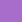

# Shep Style Guide

## Table of Contents
  - [Typography](#typography)
    - [Fonts & Typefaces](#fonts--typefaces)
  - [Colors](#colors)
    - [Palette](#palette)
    - [SASS / SCSS Variables](#sass--scss-variables)
      - [Usage](#usage)
    - [CSS Custom Properties](#css-custom-properties)
      - [Documentation](#documentation)
      - [Usage](#usage-1)
  - [Grid](#grid)
    - [Vertical Rhythm](#vertical-rhythm)
    - [Horizontal Rhythm](#horizontal-rhythm)
---

<iframe src="https://simongooder.com"/>


## Typography
While the word mark is made from DIN Next LT Pro, we use the boldness of Montserrat for headlines (bold, regular, or light) with body copy cast in the friendliness of PT Sans, for an elegant and approachable combination that embodies our spirit. Roboto Condensed is a tall and natural application with its mechanical skeleton and geometric form.

### Fonts & Typefaces

| Typeface | Weights | Usage | Embed | Download |
| --- | --- | --- | --- | --- |
| PT Sans  | 400, 700 | Used for body copy. Bold, Regular. | ```<link href="https://fonts.googleapis.com/css2?family=PT+Sans:wght@400;700&display=swap" rel="stylesheet">``` | [Google Fonts](https://fonts.google.com/specimen/PT+Sans?query=PT&sidebar.open&selection.family=PT+Sans:wght@400;700) |
| Montserrat | 400, 700 | Used for headlines. Bold, Regular, Light. | ```<link href="https://fonts.googleapis.com/css2?family=Montserrat:wght@300;400;700&display=swap" rel="stylesheet">``` | [Google Fonts](https://fonts.google.com/specimen/Montserrat?query=Mont&sidebar.open&selection.family=Montserrat:wght@300;400;700) |
| Roboto Condensed | 400, 700 | Used where headlines or body copy aren't sufficient | ```<link href="https://fonts.googleapis.com/css2?family=Roboto+Condensed:wght@400;700&display=swap" rel="stylesheet"> ``` | [Google Fonts](https://fonts.google.com/specimen/Roboto+Condensed?query=Roboto&sidebar.open&selection.family=Roboto+Condensed:wght@400;700)


---

## Colors

### Palette
**Note:** When using varibales, all colours are prefixed with `color-`. 
| Name | Color | Hex | SASS | CSS Custom Prop
| --- | :---: | --- | --- | --- |
| Royal Dark |  | `#48136A` | `$color-royal-dark` | `--color-royal-dark` |
| Royal |  | `#774099` | `$color-royal` | `--color-royal` |
| Royal Light |  | `#A86DCA` | `$color-royal-light` | `--color-royal-light` |
| Dayglow Dark |  | `#AB0061` | `$color-dayglow-dark` | `--color-dayglow-dark` |
| Dayglow |  | `#E21E8E` | `$color-dayglow` | `--color-dayglow` |
| Dayglow Light |  | `#FF61BE` | `$color-dayglow-light` | `--color-dayglow-light` |
| Dayglow Lightest |  | `#FFF7FC` | `$color-dayglow-lightest` | `--color-dayglow-lightest` |
| Smoky |  | `#1A1A1A` | `$color-gray-700` | `--color-gray-700` |
| Eclipse |  | `#343434` | `$color-gray-600` | `--color-gray-600` |
| Primer |  | `#5B5B5B` | `$color-gray-500` | `--color-gray-500` |
| Granite |  | `#8E8E8E` | `$color-gray-400` | `--color-gray-400` |
| Charcoal |  | `#CBCBCB` | `$color-gray-300` | `--color-gray-300` |
| Eerie |  | `#EAEAEA` | `$color-gray-200` | `--color-gray-200` |
| Heather |  | `#F4F4F4` | `$color-gray-100` | `--color-gray-100` |
| White |  | `#FFFFFF` | `$color-white` | `--color-white` |
| Success |  | `#1DE255` | `$color-util-success` | `--color-util-success` |
| Warning |  | `#E7E435` | `$color-util-warning` | `--color-util-warning` |
| Danger |  | `#E21D1D` | `$color-util-danger` | `--color-util-danger` |


### SASS / SCSS Variables

#### Usage
`color: $color-gray-500`

#### List of Variables
<details>
<summary> SASS / SCSS Variables Snippet </summary>

```
$color-royal:            #774099;
$color-royal-dark:       #48136A;
$color-royal-light:      #A86DCA;  

$color-dayglow:          #E21E8E;  
$color-dayglow-dark:     #AB0061;  
$color-dayglow-light:    #FF61BE;  
$color-dayglow-lightest: #FFF7FC;  

$color-gray-700:         #1A1A1A;  
$color-gray-600:         #343434;  
$color-gray-500:         #5B5B5B;  
$color-gray-400:         #8E8E8E;  
$color-gray-300:         #CBCBCB;  
$color-gray-200:         #EAEAEA;  
$color-gray-100:         #F4F4F4;  

$color-white:            #FFFFFF;

$color-util-success:     #1DE255;
$color-util-warning:     #E7E435;
$color-util-danger:      #E21D1D;

$color-gradient: linear-gradient(135deg, $color-dayglow, $color-royal);

```

</details>


### CSS Custom Properties

#### Documentation
- [Can I Use - CSS Custom Properties](https://caniuse.com/#search=custom%20properties)    
- [Mozilla - Custom Properties CSS Variables](https://developer.mozilla.org/en-US/docs/Web/CSS/--*)

#### Usage
`color: var(--color-gray-500)`
  
#### List of Variables
<details> 
<summary> Custom Properties Variables Snippet </summary>

```
:root {

    --color-royal:            #774099; 
    --color-royal-dark:       #48136A;
    --color-royal-light:      #A86DCA;

    --color-dayglow:          #E21E8E;
    --color-dayglow-dark:     #AB0061;
    --color-dayglow-light:    #FF61BE;
    --color-dayglow-lightest: #FFF7FC;

    --color-gray-600:         #1A1A1A;
    --color-gray-500:         #343434;
    --color-gray-400:         #8E8E8E;
    --color-gray-300:         #CBCBCB;
    --color-gray-200:         #EAEAEA;
    --color-gray-100:         #F4F4F4;

    --color-white:            #FFFFFF;

    --color-util-success:     #1DE255;
    --color-util-warning:     #E7E435;
    --color-util-danger:      #E21D1D;

    --color-gradient: linear-gradient(135deg, --color-dayglow, --color-royal);

}
```
</details>


---


## Grid

### Vertical Rhythm
All elements in the vertical flow will be spaced by at least `8px` units with one exception. Typographic elements within components will often use a smaller scale, separated by `4px` spaces.
- `4px` / `8px` / `16px` / `32px` / `48px` / `64px` / `72px` / `96px` / `120px` / `232px`

### Horizontal Rhythm
All elements in the horizontal flow will be spaced by at least `8px` units.
- `4px` / `8px` / `16px` / `32px` / `48px` / `64px` / `72px` / `96px` / `120px` / `232px`


