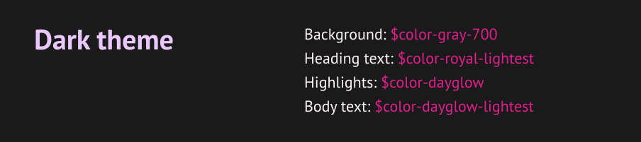

[🔙  Home](./README.md)

# Colors 

## Palette
| Name | Color | Hex | SASS | CSS Custom Prop |
| --- | :---: | --- | --- | --- |
| Royal Dark |  | `#48136A` | `$color-royal-dark` | `--color-royal-dark` |
| Royal |  | `#774099` | `$color-royal` | `--color-royal` |
| Royal Light |  | `#A86DCA` | `$color-royal-light` | `--color-royal-light` |
| Royal Lightest |  | `#EAC8FD` | `$color-royal-lightest` | `--color-royal-lightest` |
| Dayglow Dark |  | `#AB0061` | `$color-dayglow-dark` | `--color-dayglow-dark` |
| Dayglow |  | `#E21E8E` | `$color-dayglow` | `--color-dayglow` |
| Dayglow Light |  | `#FF61BE` | `$color-dayglow-light` | `--color-dayglow-light` |
| Dayglow Lightest |  | `#FFF7FC` | `$color-dayglow-lightest` | `--color-dayglow-lightest` |
| Smoky |  | `#1A1A1A` | `$color-gray-700` | `--color-gray-700` |
| Eclipse |  | `#343434` | `$color-gray-600` | `--color-gray-600` |
| Primer |  | `#5B5B5B` | `$color-gray-500` | `--color-gray-500` |
| Granite |  | `#8E8E8E` | `$color-gray-400` | `--color-gray-400` |
| Charcoal |  | `#CBCBCB` | `$color-gray-300` | `--color-gray-300` |
| Eerie |  | `#EAEAEA` | `$color-gray-200` | `--color-gray-200` |
| Heather |  | `#F4F4F4` | `$color-gray-100` | `--color-gray-100` |
| White |  | `#FFFFFF` | `$color-white` | `--color-white` |
| Success |  | `#1DE255` | `$color-util-success` | `--color-util-success` |
| Warning |  | `#E7E435` | `$color-util-warning` | `--color-util-warning` |
| Danger |  | `#E21D1D` | `$color-util-danger` | `--color-util-danger` |
| Royal Gradient |  | `linear-gradient(135deg, $color-dayglow 0%, $color-royal-dark 100%)` | `$color-grad` | `--color-grad` |

## Color Themes



## Partner Colors
<details>
<summary> Palette </summary>

| Name | Color | Hex | SASS | CSS Custom Prop |
| --- | :---: | --- | --- | --- |
| FCM Brand |  | `#00457C` | `$color-fcm-brand` | `--color-fcm-brand` |
| FCM Gradient |  | `linear-gradient(135deg, rgba($color-fcm-grad,0.37) 0%, $color-fcm-grad 100%);` | `$color-fcm-grad` | `--color-fcm-grad` |
| CT Brand |  | `#00444F` | `$color-ct-brand` | `--color-ct-brand` |
| CT Gradient |  | `linear-gradient(135deg, rgba($color-ct-grad,0.37) 0%, $color-ct-grad 100%);` | `$color-ct-grad` | `--color-ct-grad` |
</details>


## SASS Variables

### Usage
`color: $color-gray-500`

### List of Variables
<details>
<summary> SASS / SCSS Variables Snippet </summary>

```
$color-royal:            #774099;
$color-royal-dark:       #48136A;
$color-royal-light:      #A86DCA;  

$color-dayglow:          #E21E8E;  
$color-dayglow-dark:     #AB0061;  
$color-dayglow-light:    #FF61BE;  
$color-dayglow-lightest: #FFF7FC;  

$color-gray-700:         #1A1A1A;  
$color-gray-600:         #343434;  
$color-gray-500:         #5B5B5B;  
$color-gray-400:         #8E8E8E;  
$color-gray-300:         #CBCBCB;  
$color-gray-200:         #EAEAEA;  
$color-gray-100:         #F4F4F4;  

$color-white:            #FFFFFF;

$color-util-success:     #1DE255;
$color-util-warning:     #E7E435;
$color-util-danger:      #E21D1D;

$color-gradient: linear-gradient(135deg, $color-dayglow, $color-royal);

```

</details>


## CSS Custom Properties

### Documentation
- [Can I Use - CSS Custom Properties](https://caniuse.com/#search=custom%20properties)    
- [Mozilla - Custom Properties CSS Variables](https://developer.mozilla.org/en-US/docs/Web/CSS/--*)

### Usage
`color: var(--color-gray-500)`
  
### List of Variables
<details> 
<summary> Custom Properties Variables Snippet </summary>

```
:root {

    --color-royal:            #774099; 
    --color-royal-dark:       #48136A;
    --color-royal-light:      #A86DCA;

    --color-dayglow:          #E21E8E;
    --color-dayglow-dark:     #AB0061;
    --color-dayglow-light:    #FF61BE;
    --color-dayglow-lightest: #FFF7FC;

    --color-gray-600:         #1A1A1A;
    --color-gray-500:         #343434;
    --color-gray-400:         #8E8E8E;
    --color-gray-300:         #CBCBCB;
    --color-gray-200:         #EAEAEA;
    --color-gray-100:         #F4F4F4;

    --color-white:            #FFFFFF;

    --color-util-success:     #1DE255;
    --color-util-warning:     #E7E435;
    --color-util-danger:      #E21D1D;

    --color-gradient: linear-gradient(135deg, --color-dayglow, --color-royal);

}
```
</details>

